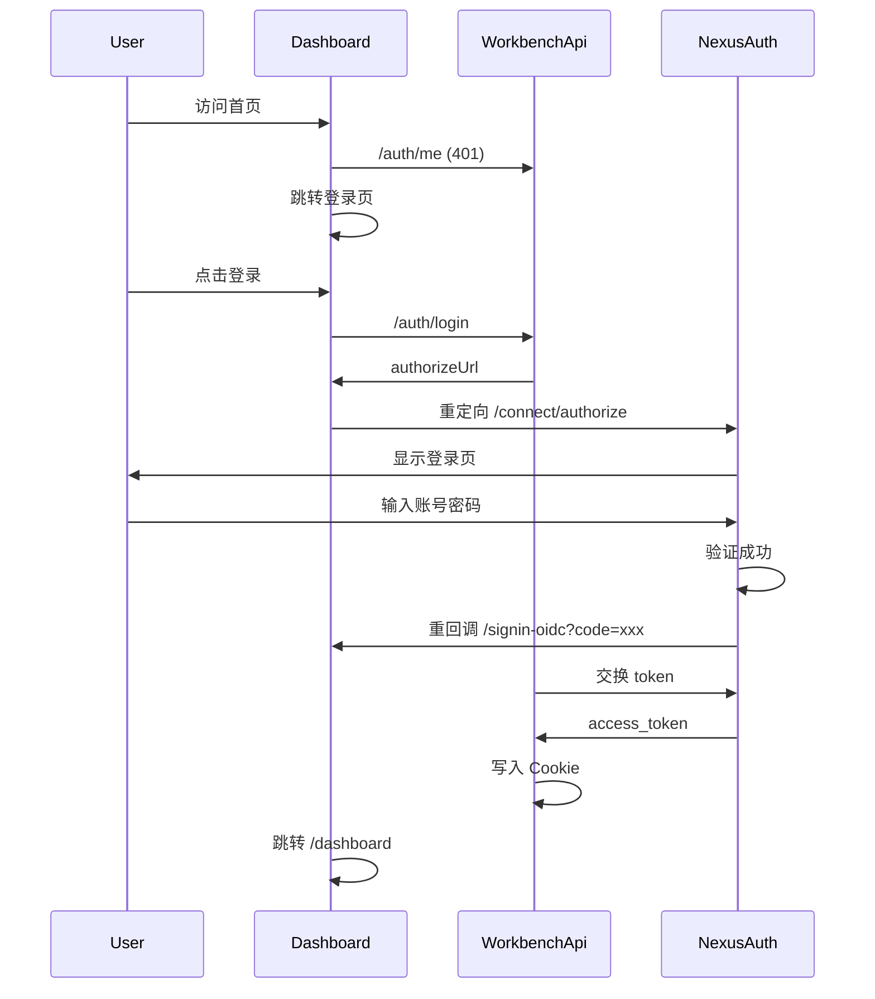

# 对接 NexusAuth.Workbench.Dashboard

本文档介绍如何将前端应用对接到 NexusAuth 统一认证平台。

## 概述

NexusAuth.Workbench.Dashboard 是一个示例前端应用，展示如何使用授权码 + PKCE 流程登录。

## 快速开始

### 安装依赖

```bash
cd src/NexusAuth.Workbench.Dashboard
npm install
```

### 启动开发服务器

```bash
npm run dev
```

访问 http://localhost:5273

## 前端对接要点

### 1. API 配置

确保 API 请求能到达后端服务：

```typescript
// src/api/request.ts
const request = axios.create({
  baseURL: '/api',
  timeout: 10000,
  withCredentials: true,
});
```

### 2. 登录流程

```typescript
// src/api/login.ts
export const startLogin = () => {
  return request.get<{ authorizeUrl: string }>('/auth/login');
};

export const getCurrentUser = () => {
  return request.get<LoginResponse>('/auth/me');
};

export const logout = () => {
  return request.post('/auth/logout');
};
```

### 3. 登录页面实现

```typescript
// src/pages/login/index.tsx
const Login = () => {
  const handleLogin = async () => {
    const result = await startLogin();
    if (result.authorizeUrl) {
      window.location.href = result.authorizeUrl;
    }
  };

  return (
    <button onClick={handleLogin}>
      使用 NexusAuth 登录
    </button>
  );
};
```

### 4. 路由守卫

```typescript
// src/router/auth.tsx
const checkAuthenticated = async () => {
  try {
    const result = await getCurrentUser();
    return result.isAuthenticated;
  } catch {
    return false;
  }
};

export const RequireAuth = () => {
  const location = useLocation();
  const [checked, setChecked] = useState(false);

  useEffect(() => {
    checkAuthenticated().then(isAuth => {
      setCachedAuthStatus(isAuth);
      setChecked(true);
    });
  }, []);

  if (!checked) return null;

  if (!getCachedAuthStatus()) {
    return <Navigate to="/login" state={{ from: location }} />;
  }

  return <Outlet />;
};
```

### 5. 登出实现

```typescript
// src/layouts/layout/avatar/index.tsx
const handleLogout = async () => {
  const result: { logoutUrl: string } = await logout();
  setCachedAuthStatus(false);
  
  if (result.logoutUrl) {
    // 跳转到 Provider 登出
    window.location.href = result.logoutUrl;
  } else {
    window.location.href = '/login';
  }
};
```

## 认证流程图



## 关键配置

### vite.config.ts

```typescript
export default defineConfig({
  server: {
    port: 5273,
    proxy: {
      '/api': {
        target: 'http://localhost:5051',
        changeOrigin: true,
      },
    },
  },
});
```

### 401 拦截处理

```typescript
// request.ts
request.interceptors.response.use(
  (response) => response.data,
  (error) => {
    if (error.response?.status === 401 && 
        !error.config?.url?.includes('/auth/')) {
      window.location.href = '/login';
    }
    return Promise.reject(error);
  }
);
```

## 下一步

- [高级配置](./08-高级配置.md)