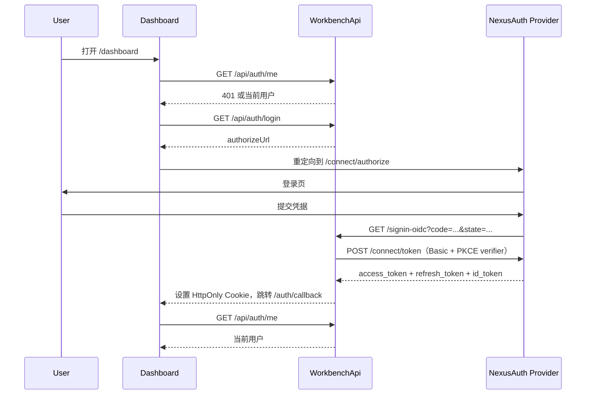

# 对接 NexusAuth.Workbench.Dashboard

Dashboard 是 Workbench 的 React + TypeScript + Vite 前端。它不直接访问 NexusAuth Provider，也不保存 OAuth token；所有认证和管理请求都通过 Workbench API 完成。

## 1. 本地启动

先启动 Provider 和 Workbench API，并确认 API 的 `Auth:PostLogoutRedirectUri` 指向 Dashboard 地址。然后在仓库根目录执行：

```bash
npm --prefix admin/src/NexusAuth.Workbench.Dashboard install
npm --prefix admin/src/NexusAuth.Workbench.Dashboard run dev
```

开发服务器监听 http://localhost:5273。打开该地址即可进入登录页。

常用检查命令：

```bash
npm --prefix admin/src/NexusAuth.Workbench.Dashboard run build
npm --prefix admin/src/NexusAuth.Workbench.Dashboard run lint
```

## 2. API 请求和 Cookie

现有请求封装位于 `src/api/request.ts`，关键配置如下：

```typescript
const request = axios.create({
  baseURL: '/api',
  timeout: 10000,
  withCredentials: true,
});
```

`withCredentials: true` 是必须的，否则浏览器不会发送 Workbench API 的 HttpOnly Cookie。当前请求封装还会：

- 将 API 的 `{ success, result, errorCode, errorMessage }` 响应解包为业务结果；
- 将失败响应转换为 Axios error；
- 对非认证接口的 HTTP 401 跳转到 `/login`。

Dashboard 开发代理定义在 `vite.config.ts`：

```typescript
server: {
  port: 5273,
  proxy: {
    '/api': {
      target: 'http://localhost:5051',
      changeOrigin: true,
    },
  },
},
```

不要把 `http://localhost:5051` 写进前端业务请求；使用 `/api` 才能同时兼容 Vite 开发代理和 Compose nginx 代理。

## 3. 登录流程

认证 API 封装在 `src/api/login.ts`：

| 前端调用 | API 端点 | 结果 |
|----------|----------|------|
| `getConfig()` | `GET /api/auth/config` | 获取公开的 Provider 地址和 client 信息 |
| `startLogin()` | `GET /api/auth/login` | 获取带 state、nonce、S256 PKCE 的 `authorizeUrl` |
| `getCurrentUser()` | `GET /api/auth/me` | 获取当前 Workbench 用户；未登录返回 401 |
| `logout()` | `POST /api/auth/logout` | 清理 BFF Cookie，并返回可选的 Provider 登出地址 |

启动时，`App.tsx` 会先调用 `checkAuthenticated()`，成功后才渲染路由。未登录用户进入 `/login`，登录页调用 `startLogin()` 并将浏览器重定向到 Provider。

Provider 登录成功后回调 Workbench API 的 `GET /signin-oidc`。API 在服务端兑换授权码、写入受保护的 `.NexusAuth.Workbench` Cookie，然后重定向 Dashboard 的 `/auth/callback`。该路由设置内存中的认证状态并跳转 `/dashboard`；页面随后继续通过 `/api/auth/me` 验证服务端会话。

## 4. 路由和登出

当前路由包含：

- `/login`：登录页；
- `/auth/callback`：OIDC 回调后的短暂跳转页；
- `/dashboard`：需要认证的主页；
- 其他管理页：由动态菜单加载并置于认证布局下。

顶栏登出操作调用 `POST /api/auth/logout`。如果 API 返回 `logoutUrl`，浏览器会先跳转到 Provider 的 `/connect/endsession`，Provider 完成 SSO 会话撤销后再回到 `PostLogoutRedirectUri`；没有该地址时直接回到 `/login`。

不要把 access token 或 refresh token 写入 `localStorage`、`sessionStorage` 或前端构建产物。前端缓存的认证状态只是路由优化，不能代替服务端鉴权。

## 5. 管理页面使用的接口

Workbench API 已提供以下管理资源，前端 API 模块均通过相对路径调用：

| 前端模块 | API 路径 | 用途 |
|----------|----------|------|
| `src/api/client.ts` | `/api/clients` | OAuth client 和凭据 |
| `src/api/api-resource.ts` | `/api/api-resources` | API resource |
| `src/api/user.ts` | `/api/users` | 用户资料、状态和密码 |
| `src/api/scim-credential.ts` | `/api/scim-credentials` | SCIM 凭据 |
| `src/api/login-audit.ts` | `/api/login-audits` | 登录审计 |
| `src/api/auth.ts` | 本地菜单数据 | 菜单和导航信息 |

管理请求需要 Workbench API 的 Cookie 或有效 Bearer access token。浏览器场景使用 Cookie；不应让 Dashboard 自己组装 `Authorization` 头保存令牌。

## 6. 生产构建和反向代理

执行构建：

```bash
npm --prefix admin/src/NexusAuth.Workbench.Dashboard run build
```

Compose 使用 `admin/src/NexusAuth.Workbench.Dashboard/Dockerfile` 构建静态文件，再由 nginx 监听容器 80 端口。`nginx.conf` 将 `/api` 转发到 `admin-api:8080`，其余路径回退到 `index.html`，因此外部地址仍是 http://localhost:5273。

若单独部署 Dashboard，请确保：

1. `/api` 由同源反向代理转发到 Workbench API，并保留 Cookie、Host、X-Forwarded-* 头；
2. Provider 登记的 `RedirectUri` 指向外部可访问的 Workbench API `/signin-oidc`，而不是静态 Dashboard 文件路径；
3. `PostLogoutRedirectUri` 指向 Dashboard 根地址，并在 Provider 客户端登记；
4. 生产环境全程使用 HTTPS，并让 Cookie 的 Secure、SameSite 和反向代理协议保持一致。

同源代理优先于跨域直连。若必须跨域，需同时配置 API 的 CORS、凭据策略和正确的 Cookie Domain/SameSite；当前仓库默认 nginx 配置按同源部署设计。

## 7. 认证流程图


```mermaid
sequenceDiagram
    participant User
    participant Dashboard
    participant WorkbenchApi
    participant Provider as NexusAuth Provider

    User->>Dashboard: 打开 /dashboard
    Dashboard->>WorkbenchApi: GET /api/auth/me
    WorkbenchApi-->>Dashboard: 401 或当前用户
    Dashboard->>WorkbenchApi: GET /api/auth/login
    WorkbenchApi-->>Dashboard: authorizeUrl
    Dashboard->>Provider: 重定向到 /connect/authorize
    Provider->>User: 登录页
    User->>Provider: 提交凭据
    Provider->>WorkbenchApi: GET /signin-oidc?code=...&state=...
    WorkbenchApi->>Provider: POST /connect/token（Basic + PKCE verifier）
    Provider-->>WorkbenchApi: access_token + refresh_token + id_token
    WorkbenchApi-->>Dashboard: 设置 HttpOnly Cookie，跳转 /auth/callback
    Dashboard->>WorkbenchApi: GET /api/auth/me
    WorkbenchApi-->>Dashboard: 当前用户
```

## 8. 常见问题

- 页面一直回到登录页：确认 `/api` 代理目标是 5051、请求使用 `withCredentials: true`，并检查浏览器是否拦截了 Cookie。
- 回调地址 404：Provider client 的 `redirect_uris` 必须登记 Workbench API 的 `/signin-oidc`，并确保该地址被 API 暴露。
- 回调后登录失败：查看 Workbench API 日志，重点检查 `Auth:Authority`、`Auth:BackchannelAuthority`、client secret 和 Provider Discovery。
- 管理 API 返回 401：确认用户 Cookie 尚未过期，并检查 Workbench API 的 `Auth:Audience` 与内置 `workbench` API resource audience 一致。
- Compose 修改配置不生效：执行 `docker compose up -d` 让服务按新环境变量重建；仅 `docker compose restart` 不会重新套用 Compose 文件中的变量。

更多 API/BFF 配置见 [对接 NexusAuth.Workbench](./06-对接NexusAuth.Workbench.md)。
