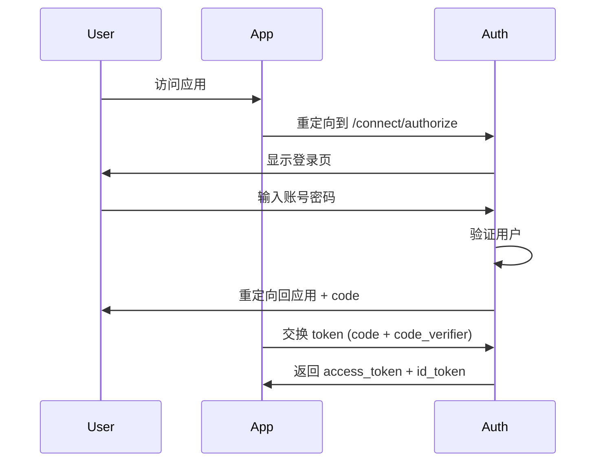

# NexusAuth 统一身份认证平台

<p align="center">
  
  
  
  
</p>

NexusAuth 是一个开源的统一身份认证平台（OAuth 2.0 / OIDC Provider），支持多种 OAuth 认证流程，为多个前端应用提供统一的登录认证服务。

## 核心特性

- **多认证流程支持**：Authorization Code + PKCE、Client Credentials、Device Code
- **统一登录**：所有前端应用通过 NexusAuth 实现单点登录
- **PKCE 支持**：安全性更高的授权码模式
- **Token 刷新**：自动刷新 access_token
- **登出联动**：RP-Initiated Logout，支持同时退出所有应用

## 系统架构

```
┌─────────────────┐     ┌─────────────────┐     ┌─────────────────┐
│   Dashboard     │     │   Workbench API │     │  Other Apps     │
│  (Frontend)     │◄───►│  (BFF/Backend)  │◄───►│                 │
└─────────────────┘     └─────────────────┘     └─────────────────┘
         │                        │                        │
         │    OAuth 2.0 / OIDC    │                        │
         └────────────────────────┼────────────────────────┘
                                  │
                                  ▼
                          ┌─────────────────┐
                          │  NexusAuth      │
                          │  Provider       │
                          │  :5100          │
                          └─────────────────┘
                                  │
                                  ▼
                          ┌─────────────────┐
                          │   PostgreSQL    │
                          │   Database      │
                          └─────────────────┘
```

## 快速导航

| 文档 | 描述 |
|------|------|
| [快速开始](./01-快速开始.md) | 5分钟快速部署 |
| [环境准备](./02-环境准备.md) | 开发环境要求 |
| [数据库配置](./03-数据库配置.md) | PostgreSQL 配置 |
| [启动 Provider](./04-启动NexusAuth.Provider.md) | 启动认证服务 |
| [配置 OAuth 客户端](./05-配置OAuth客户端.md) | 添加客户端应用 |
| [启动 Workbench](./06-对接NexusAuth.Workbench.md) | 启动管理端 |
| [启动 Dashboard](./07-对接NexusAuth.Workbench.Dashboard.md) | 启动前端 |
| [高级配置](./08-高级配置.md) | 高级功能配置 |
| [常见问题](./09-常见问题.md) | FAQ |

## 技术栈

- **后端**：.NET 9.0 + ASP.NET Core
- **前端**：React 19 + TDesign React
- **数据库**：PostgreSQL 16
- **ORM**：Entity Framework Core

## 项目结构

```
src/
├── NexusAuth.Host/           # OAuth Provider (认证服务)
├── NexusAuth.Workbench.Api/  # Workbench API (后端服务)
├── NexusAuth.Workbench.Dashboard/ # Workbench Dashboard (前端)
├── NexusAuth.Extension/    # 通用扩展类库
├── NexusAuth.Domain/       # 领域模型
├── NexusAuth.Persistence/  # 数据访问
└── NexusAuth.Application/  # 应用服务
```

## 认证流程

### Authorization Code + PKCE（推荐）



## 配置 OAuth 客户端

每个需要接入的应用需要在数据库中配置以下信息：

- **ClientId**：应用唯一标识
- **ClientSecret**：应用密钥（可选，公共客户端可不用）
- **RedirectUri**：授权回调地址
- **PostLogoutRedirectUri**：登出回调地址
- **AllowedScopes**：授权 scope（openid, profile 等）
- **AllowedGrantTypes**：授权模式（authorization_code 等）

详细配置见 [05-配置OAuth客户端.md](./05-配置OAuth客户端.md)

## 贡献指南

欢迎提交 Issue 和 Pull Request！

## 许可证

MIT License - see [LICENSE](LICENSE) for details.