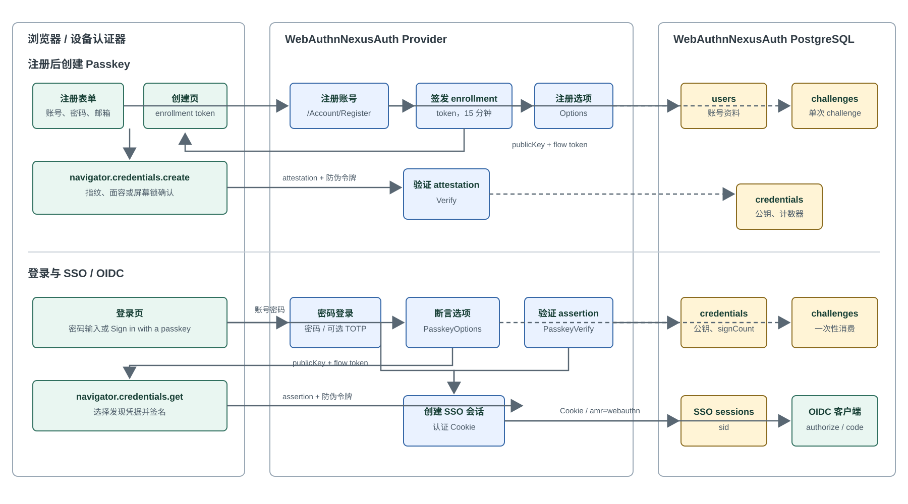

# WebAuthnNexusAuth 使用与登录流程

本文说明当前 Web 端 Passkey 实现的实际行为、接口与本地使用方式。它对应独立部署的 `WebAuthnNexusAuth` 数据库和 Provider；目前不包含原生 App 的 WebAuthn 接口。

## 总览



系统同时保留两种登录入口：

- 账号密码登录：沿用现有登录页和可选 TOTP 流程。
- Passkey 登录：用户点击 **Sign in with a passkey**，浏览器通过设备认证器选择发现凭据，无须事先输入账号。

Passkey 的私钥、生物识别模板和解锁信息均保留在用户的设备或其 Passkey 同步服务中。NexusAuth 仅保存 WebAuthn 公钥、Credential ID、签名计数器以及必要的设备元数据。

## 账号注册与创建 Passkey

1. 用户访问 `/Account/Register`，提交账号、昵称、邮箱和密码。
2. `RegisterModel.OnPostAsync` 创建普通 NexusAuth 账号，通过 `IWebSignInService` 建立 SSO Session 并签发认证 Cookie。用户从此时起已经登录，不需要再次输入密码。
3. Passkey 开启时，服务端生成有效期 15 分钟的受保护 enrollment token，并重定向到：

   ```text
   /Account/PasskeyEnrollment?token=...
   ```

4. 创建页由用户选择 **创建 Passkey** 或 **暂时跳过**，不会自动弹出系统认证器。跳过后直接进入原授权流程或 `/account`，登录状态保持不变。
5. 浏览器向 `/account/PasskeyEnrollment?handler=Options` 发起 JSON `POST`；请求携带 enrollment token 和 Razor 防伪令牌 `RequestVerificationToken`。
6. `PasskeyEnrollmentModel.OnPostOptionsAsync` 验证 enrollment token 和用户状态，排除已有凭据，为当前用户创建 `CredentialCreateOptions`。选项和随机 flow token 会写入 `webauthn_challenges`。
7. 浏览器把 Base64URL 编码的数据还原为二进制，调用 `navigator.credentials.create({ publicKey })`。系统会显示指纹、面容或屏幕锁定对话框。
8. 浏览器向 `/account/PasskeyEnrollment?handler=Verify` 提交 attestation、flow token 和防伪令牌。
9. 服务端原子消费 challenge，用 Fido2NetLib 验证 attestation；验证成功后将 Credential ID、公钥 COSE、签名计数器、AAGUID、传输方式和备份状态保存到 `webauthn_credentials`。
10. 页面进入原授权流程或 `/account`。账号此时既可密码登录，也可 Passkey 登录。

注册后创建 Passkey 是当前唯一的建档路径。因此一个完全不存在的账号，不能直接通过登录页的 Passkey 按钮注册；必须先完成普通注册。这样能保证账号的用户名、邮箱和初始身份验证责任明确。

## Passkey 登录

1. 用户打开 `/account/login`，可勾选 Remember me，点击 **Sign in with a passkey**。
2. 页面将 `returnUrl`、Remember me 状态和防伪令牌发送到 `/account/login?handler=PasskeyOptions`。
3. `LoginModel.OnPostPasskeyOptionsAsync` 创建没有 `allowCredentials` 的 `AssertionOptions`，即请求可发现凭据（discoverable credential）。浏览器的 Passkey 选择器据此识别用户，而不是依赖事先输入的用户名。
4. 服务端把断言选项、SHA-256 后的 flow token、returnUrl、Remember me 和 5 分钟过期时间存到 `webauthn_challenges`，并返回 `{ flowToken, publicKey }`。
5. 浏览器调用 `navigator.credentials.get({ publicKey })`。用户在本机认证器中确认后，认证器使用私钥对本次 challenge 签名，浏览器返回 assertion。
6. 页面将 assertion、flow token 和防伪令牌提交到 `/account/login?handler=PasskeyVerify`。
7. `LoginModel.OnPostPasskeyVerifyAsync` 原子消费 challenge，按 `rawId` 查找凭据与用户，并校验用户状态与安全策略。
8. Fido2NetLib 使用数据库内的公钥、原签名计数器和断言选项验证签名、RP ID、Origin、challenge、用户句柄及签名计数器。验证成功后，服务端将凭据对应的用户 ID 回填到该 authentication challenge，再更新 `signature_counter`、`last_used_at` 和备份状态。
9. 服务端创建 SSO session、写入认证 Cookie，并重定向到原始本地 `returnUrl` 或 `/account`。

Passkey 成功登录时 Cookie 的身份声明包含：

| 声明 | 值 |
| --- | --- |
| `amr` | `webauthn` |
| `acr` | `urn:nexusauth:acr:webauthn-uv` |
| `auth_time` | Passkey 验证成功时的 Unix 时间戳 |
| `sid` | 新建 SSO session ID |

后续 OIDC 客户端跳转到 `/connect/authorize` 时，会复用该 SSO Cookie，完成既有授权码与 Token 颁发流程。

## 密码登录仍然可用

在同一登录页输入账号和密码后，表单仍提交给 `LoginModel.OnPostAsync`。它校验账号状态和安全策略；若系统对该账号启用了 TOTP，继续走现有的 TOTP 步骤。密码登录最终也创建 SSO session 和 Cookie，但认证声明为 `amr=pwd` 或 `amr=pwd otp`。

这意味着 Passkey 在当前实现中是新增登录方式，而不是删除密码或强制替代密码的机制。

## 端点与页面归属

| 用途 | 页面 / 处理器 | HTTP |
| --- | --- | --- |
| 普通注册 | `/Account/Register`，`OnPostAsync` | 表单 POST |
| 显示创建页 | `/Account/PasskeyEnrollment?token=...`，`OnGet` | GET |
| 获取注册选项 | `/account/PasskeyEnrollment?handler=Options`，`OnPostOptionsAsync` | JSON POST |
| 验证并保存凭据 | `/account/PasskeyEnrollment?handler=Verify`，`OnPostVerifyAsync` | JSON POST |
| 密码登录 | `/account/login`，`OnPostAsync` | 表单 POST |
| 获取登录断言选项 | `/account/login?handler=PasskeyOptions`，`OnPostPasskeyOptionsAsync` | JSON POST |
| 验证登录断言 | `/account/login?handler=PasskeyVerify`，`OnPostPasskeyVerifyAsync` | JSON POST |

这些都是 Razor Pages 的 PageModel handlers，当前没有 `PasskeyController`。前端 AJAX 从页面读取 `__RequestVerificationToken`，并通过 `RequestVerificationToken` 请求头发送；服务端沿用 Razor Pages 的防伪校验。

PageModel 只负责 HTTP 输入输出和调用 FIDO2 协议验证；challenge 与 credential 的创建、消费、查询和状态更新统一通过 Application 层的 `IWebAuthnService` 编排，再由 Repository 持久化领域实体。Repository 不直接修改属性，状态变化由 `WebAuthnChallenge` 和 `WebAuthnCredential` 的领域方法完成。

## 数据与安全控制

独立数据库名为 `WebAuthnNexusAuth`。初始化脚本 [webauthn-production-init.sql](../webauthn-production-init.sql) 创建两张 WebAuthn 专用表：

| 表 | 用途 |
| --- | --- |
| `nexusauth.webauthn_credentials` | 保存每个 Passkey 的公钥、Credential ID、计数器、备份状态和显示名称。Credential ID 唯一。 |
| `nexusauth.webauthn_challenges` | 保存注册或认证选项、单次使用 token 的 SHA-256 哈希、用途、过期时间、returnUrl 与 Remember me 状态。 |

注册 challenge 创建时已经知道账号，因此立即保存 `user_id`。无用户名 Passkey 登录在创建 authentication challenge 时还不知道用户，`user_id` 会暂时为空；服务端验证 assertion 成功并通过 Credential ID 确定账号后，才回填可信的 `user_id`。失败、取消或过期的 authentication challenge 不会伪造用户归属。

挑战默认有效 300 秒，可通过 `NEXUSAUTH_WEBAUTHN_CHALLENGE_LIFETIME_SECONDS` 配置，允许范围是 60 到 900 秒。验证处理器通过条件更新消费 challenge；过期、重复使用或伪造的 flow token 都会得到 `invalid_challenge`，不能重放。

`returnUrl` 只接受 `Url.IsLocalUrl` 判定为本地地址的值，避免开放重定向。登录和创建页发送 `no-store` / `no-cache` 响应头，降低浏览器缓存旧 token 页面的风险。

## 本地调试

启动独立环境：

```bash
docker compose -f docker-compose.webauthn.yml up --build
```

打开 [http://localhost:5200](http://localhost:5200)。`localhost` 是 WebAuthn 开发环境允许的 secure-context 例外，不需要本地自签名证书。

需要在 DBeaver 查看独立数据库时，连接 `localhost:56783`，数据库为 `WebAuthnNexusAuth`，默认用户名为 `webauthnnexusauth`，默认密码为 `webauthnnexusauth_dev_password`，业务表位于 `nexusauth` schema。

建议按下面顺序验证：

1. 访问 `/Account/Register`，注册一个新账号。
2. 创建页出现后，允许浏览器或系统认证器创建 Passkey。
3. 跳转到登录页后，点击 **Sign in with a passkey**，选择刚创建的 Passkey。
4. 登录成功后查看 `/account`，或携带 OIDC 的 `returnUrl` 从客户端发起授权请求。

常用排错命令：

```bash
docker compose -f docker-compose.webauthn.yml ps
docker compose -f docker-compose.webauthn.yml logs -f webauthn-nexusauth-sso
docker compose -f docker-compose.webauthn.yml exec webauthn-nexusauth-db \
  psql -U postgres -d WebAuthnNexusAuth -c 'SELECT user_id, display_name, created_at, last_used_at, disabled_at FROM nexusauth.webauthn_credentials;'
```

若页面报 `404`，先确认使用的是大小写正确的页面路径 `/account/PasskeyEnrollment?handler=Options` 和 `/account/PasskeyEnrollment?handler=Verify`，不要使用已移除的 `/account/passkey-enrollment` 或控制器风格的 `/account/passkey/...` 路由。

若认证器不弹窗，检查浏览器是否支持 `PublicKeyCredential`、是否使用 `localhost` 或 HTTPS，以及系统是否配置屏幕锁/生物识别。若服务端返回 `invalid_challenge`，通常是挑战已过期、页面被缓存或请求重复提交，刷新页面重新开始。

## 生产配置

生产环境必须使用 HTTPS，并保证实际访问域名、RP ID 和 Origin 一致。例如：

```bash
WEBAUTHN_NEXUSAUTH_ENVIRONMENT=Production
WEBAUTHN_NEXUSAUTH_ENABLED=true
WEBAUTHN_NEXUSAUTH_ISSUER=https://auth.example.com
WEBAUTHN_NEXUSAUTH_RP_ID=auth.example.com
WEBAUTHN_NEXUSAUTH_ORIGIN=https://auth.example.com
WEBAUTHN_NEXUSAUTH_POSTGRES_PASSWORD=REPLACE_WITH_SECRET
```

普通 Host 可通过 `NEXUSAUTH_WEBAUTHN_ENABLED=true|false` 控制功能，默认关闭；独立 Compose 使用 `WEBAUTHN_NEXUSAUTH_ENABLED=true|false`，默认开启。关闭后登录页不显示 Passkey，新用户注册后跳过建档页，相关 handlers 返回 404。

在反向代理之后，必须向 Provider 正确转发外部 HTTPS 的 `Host` 与 `Proto`。RP ID、Origin、Issuer 或用户实际访问地址任意不一致，浏览器或 FIDO2 验证都会拒绝操作。独立容器、端口和数据库的部署说明见 [WebAuthnNexusAuth-部署.md](WebAuthnNexusAuth-部署.md)。

## 当前范围

- 已实现：Web 注册后建 Passkey、无用户名的 Passkey 登录、密码登录回退、SSO/OIDC 会话复用。
- 尚未实现：已登录用户新增/删除/禁用 Passkey 的管理页、Passkey 丢失后的账号恢复流程、原生 App 的 WebAuthn API 与 App 侧深链回调。
